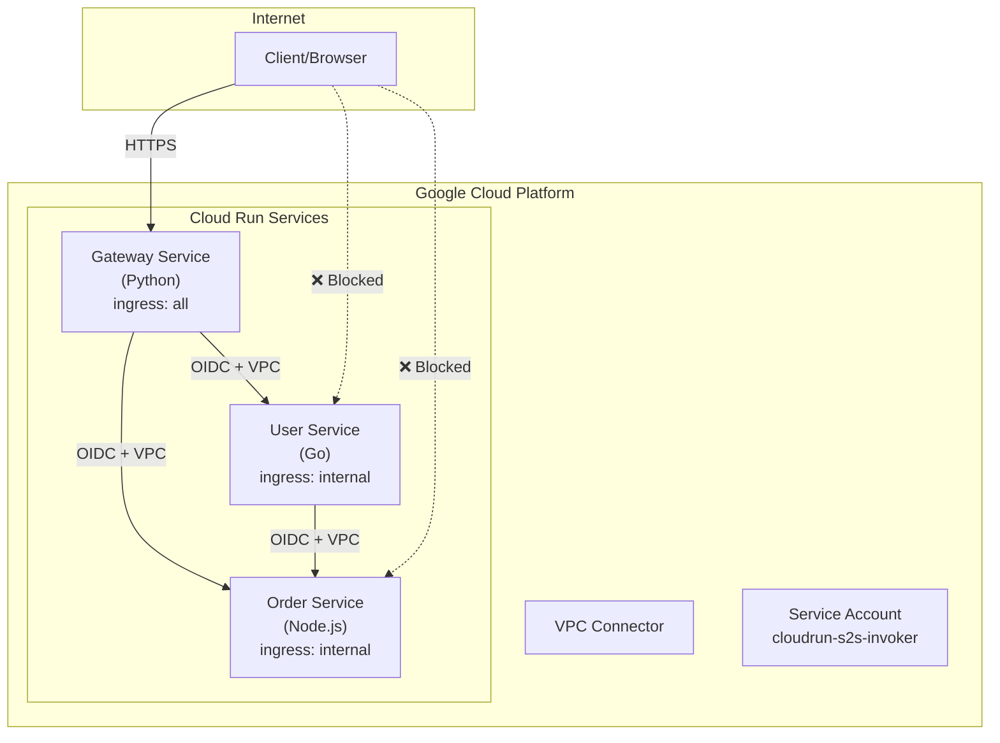
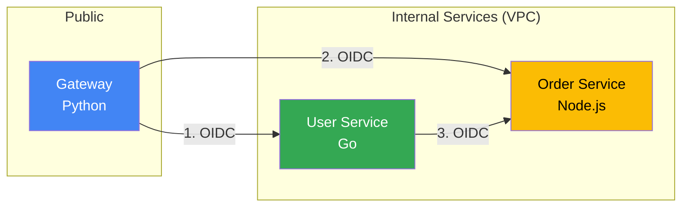
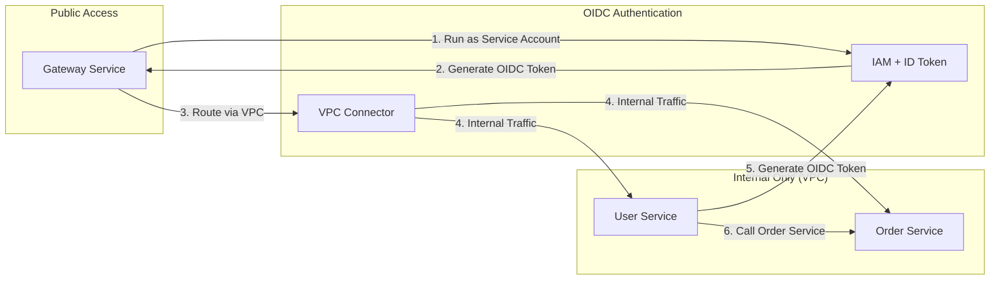
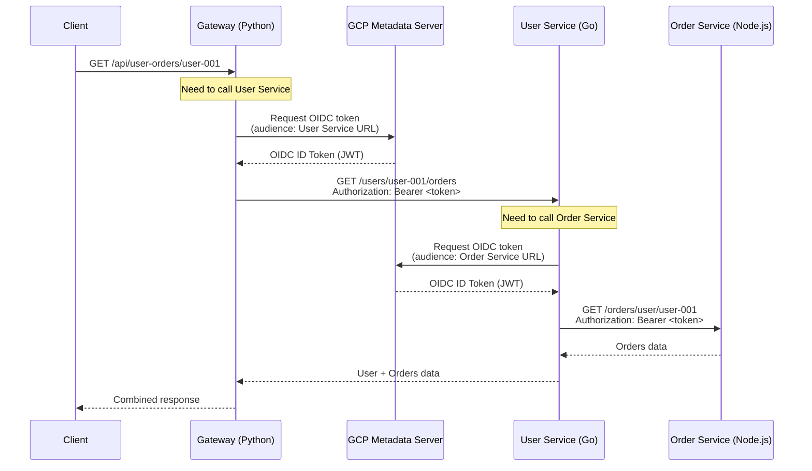
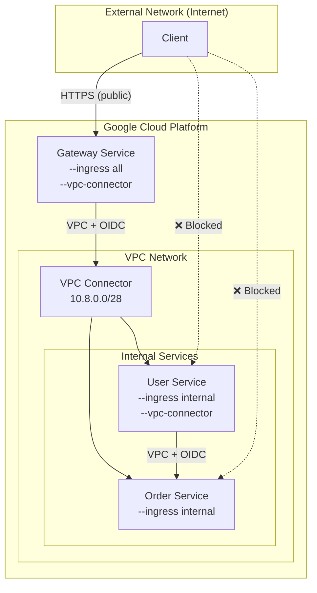
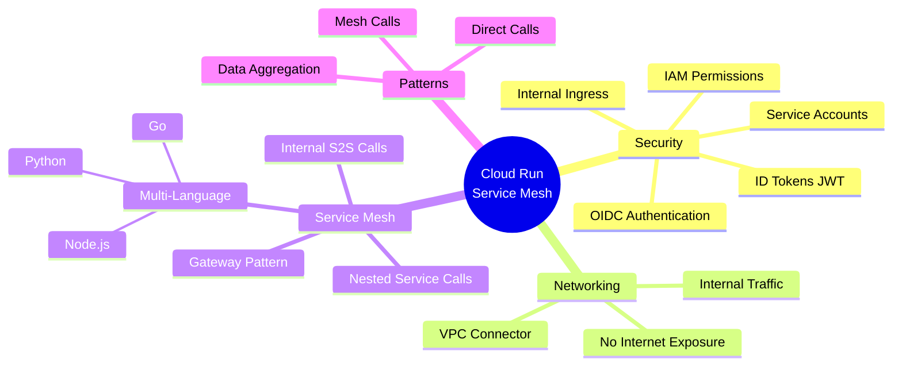

# Cloud Run Service-to-Service Communication Demo

This demo demonstrates how to implement secure service-to-service communication between Cloud Run instances using **OIDC (OpenID Connect) authentication** and **internal networking** in a **service mesh pattern**. It features three microservices written in different programming languages.

## Architecture Overview



## Service Mesh Pattern

This demo implements a **service mesh pattern** where internal services can communicate with each other, not just through a central gateway:



### Communication Patterns

| Pattern | Flow | Use Case |
|---------|------|----------|
| Direct | Gateway → Order Service | Simple data fetch |
| Direct | Gateway → User Service | Simple data fetch |
| **Mesh** | Gateway → User Service → Order Service | User Service enriches data from Order Service |

## Security Model



## OIDC Authentication Flow

All services use **OIDC (OpenID Connect) ID tokens** for authentication:



### OIDC Token Details

The OIDC ID token is a **JSON Web Token (JWT)** with the following structure:

**Header:**
```json
{
  "alg": "RS256",
  "typ": "JWT",
  "kid": "<key-id>"
}
```

**Payload (Claims):**
```json
{
  "iss": "https://accounts.google.com",
  "aud": "https://user-service-xxxxx-uc.a.run.app",
  "sub": "cloudrun-s2s-invoker@project-id.iam.gserviceaccount.com",
  "email": "cloudrun-s2s-invoker@project-id.iam.gserviceaccount.com",
  "iat": 1700000000,
  "exp": 1700003600
}
```

## Services

### Gateway Service (Python)
- **Language**: Python 3.12 with Flask
- **Role**: Public-facing API gateway and orchestrator
- **Ingress**: `all` (publicly accessible)
- **Egress**: Via VPC Connector (internal network)
- **Authentication**: Generates OIDC ID tokens for internal calls
- **Endpoints**:
  - `GET /` - Health check
  - `GET /api/users` - Get all users (calls User Service)
  - `GET /api/users/{id}` - Get specific user
  - `GET /api/orders` - Get all orders (calls Order Service)
  - `POST /api/orders` - Create new order
  - `GET /api/aggregate` - Aggregate from all services
  - `GET /api/user-orders/{userId}` - **Mesh pattern**: Gateway → User → Order
  - `GET /api/user-orders-direct/{userId}` - Direct pattern: Gateway → User + Gateway → Order

### User Service (Go)
- **Language**: Go 1.22
- **Role**: User management + can call Order Service
- **Ingress**: `internal` (VPC only)
- **Egress**: Via VPC Connector (can call other internal services)
- **Authentication**: 
  - Validates incoming OIDC tokens (via Cloud Run)
  - Generates OIDC tokens to call Order Service
- **Endpoints**:
  - `GET /users` - List all users
  - `GET /users/{id}` - Get specific user
  - `GET /users/{id}/orders` - **Mesh**: Get user's orders (calls Order Service)
  - `POST /users` - Create new user
  - `DELETE /users/{id}` - Delete user

### Order Service (Node.js)
- **Language**: Node.js 20 with Express
- **Role**: Order management microservice
- **Ingress**: `internal` (VPC only)
- **Authentication**: Validates incoming OIDC tokens (via Cloud Run)
- **Endpoints**:
  - `GET /orders` - List all orders (with filters)
  - `GET /orders/{id}` - Get specific order
  - `GET /orders/user/{userId}` - Get orders by user
  - `POST /orders` - Create new order
  - `PATCH /orders/{id}/status` - Update order status
  - `DELETE /orders/{id}` - Delete order
  - `GET /stats` - Get order statistics

## Internal Networking



### Key Configuration

1. **VPC Connector**: Created in the default VPC network with IP range `10.8.0.0/28`

2. **Gateway Service**:
   ```bash
   --ingress all               # Accept public traffic
   --vpc-connector s2s-connector
   --vpc-egress all-traffic    # Route all egress through VPC
   ```

3. **User Service** (can call Order Service):
   ```bash
   --ingress internal          # Only accept VPC traffic
   --vpc-connector s2s-connector
   --vpc-egress all-traffic    # Can call other internal services
   ```

4. **Order Service**:
   ```bash
   --ingress internal          # Only accept VPC traffic
   ```

## Code Examples

### Python (Gateway) - OIDC Token Generation

```python
import google.oauth2.id_token
import google.auth.transport.requests

def get_id_token(audience: str) -> str:
    """Get OIDC ID token for service-to-service auth."""
    auth_req = google.auth.transport.requests.Request()
    return google.oauth2.id_token.fetch_id_token(auth_req, audience)

def call_internal_service(url: str) -> dict:
    audience = f"{url.split('/')[0]}//{url.split('/')[2]}"
    token = get_id_token(audience)
    headers = {'Authorization': f'Bearer {token}'}
    return requests.get(url, headers=headers).json()
```

### Go (User Service) - OIDC Token Generation

```go
func getIDToken(ctx context.Context, audience string) (string, error) {
    // Request ID token from metadata server
    url := fmt.Sprintf(
        "http://metadata.google.internal/computeMetadata/v1/instance/service-accounts/default/identity?audience=%s",
        audience,
    )
    req, _ := http.NewRequestWithContext(ctx, "GET", url, nil)
    req.Header.Set("Metadata-Flavor", "Google")
    
    resp, err := http.DefaultClient.Do(req)
    if err != nil {
        return "", err
    }
    defer resp.Body.Close()
    
    token, _ := io.ReadAll(resp.Body)
    return string(token), nil
}
```

## Prerequisites

- Google Cloud SDK (`gcloud`) installed and configured
- A GCP project with billing enabled
- Permissions to:
  - Create and deploy Cloud Run services
  - Create VPC Connectors
  - Create service accounts
  - Modify IAM policies
  - Enable APIs

## Required APIs

| API | Purpose |
|-----|---------|
| `cloudbuild.googleapis.com` | Build container images from source |
| `run.googleapis.com` | Deploy and run Cloud Run services |
| `artifactregistry.googleapis.com` | Store container images |
| `iam.googleapis.com` | Manage service accounts and permissions |
| `vpcaccess.googleapis.com` | Create VPC connectors for internal networking |
| `compute.googleapis.com` | VPC network resources |

## Quick Start

### 1. Set up your GCP project

```bash
gcloud config set project YOUR_PROJECT_ID
export GCP_REGION=us-central1  # Optional, defaults to us-central1
```

### 2. Deploy the services

```bash
cd cloudrun-service2service
chmod +x 01-setup.sh 02-test.sh 99-cleanup.sh
./01-setup.sh
```

### 3. Test the deployment

```bash
./02-test.sh
```

### 4. Manual testing

```bash
GATEWAY_URL=$(gcloud run services describe gateway-service \
    --region us-central1 --format 'value(status.url)')

# Health check
curl $GATEWAY_URL/

# Direct calls to services via Gateway
curl $GATEWAY_URL/api/users
curl $GATEWAY_URL/api/orders

# SERVICE MESH PATTERN: Gateway → User Service → Order Service
curl $GATEWAY_URL/api/user-orders/user-001

# Compare with DIRECT PATTERN: Gateway → User + Gateway → Order
curl $GATEWAY_URL/api/user-orders-direct/user-001
```

### 5. Clean up

```bash
./99-cleanup.sh
```

## API Reference

### Mesh vs Direct Pattern Comparison

**Mesh Pattern** (`/api/user-orders/{userId}`):
```
Client → Gateway → User Service → Order Service
                         ↓
                   Combined Response
```

**Direct Pattern** (`/api/user-orders-direct/{userId}`):
```
Client → Gateway → User Service (get user)
              └─→ Order Service (get orders)
                         ↓
                   Combined Response
```

### Response Examples

**Mesh Pattern Response:**
```json
{
  "source": "gateway-service (Python)",
  "workflow": "user-orders-mesh",
  "flow": "Gateway → User Service → Order Service",
  "mesh_path": [
    "gateway-service (Python)",
    "user-service (Go)",
    "order-service (Node.js)"
  ],
  "data": {
    "service": "user-service (Go)",
    "user": { "id": "user-001", "name": "Alice" },
    "orders": { "count": 2, "orders": [...] },
    "flow": "User Service (Go) → Order Service (Node.js) via OIDC"
  }
}
```

## Project Structure

```
cloudrun-service2service/
├── README.md
├── 01-setup.sh           # Deployment script
├── 02-test.sh            # Test script
├── 99-cleanup.sh         # Cleanup script
├── gateway-service/      # Python Gateway
│   ├── Dockerfile
│   ├── main.py
│   └── requirements.txt
├── user-service/         # Go User Service (calls Order Service)
│   ├── Dockerfile
│   ├── go.mod
│   └── main.go
└── order-service/        # Node.js Order Service
    ├── Dockerfile
    ├── package.json
    └── index.js
```

## Key Concepts Demonstrated



## Troubleshooting

### 403 Forbidden from Gateway to Internal Services

- Verify service account has `roles/run.invoker` on target service
- Check Gateway uses correct service account
- Verify VPC connector is configured

### User Service Cannot Call Order Service

- Verify User Service has `--vpc-connector` configured
- Verify User Service has `--vpc-egress all-traffic`
- Check User Service uses the invoker service account

### Authentication Errors

```bash
# Check service account permissions
gcloud run services get-iam-policy order-service --region us-central1

# Verify service is using correct service account
gcloud run services describe user-service --region us-central1 \
    --format='value(spec.template.spec.serviceAccountName)'
```

## Cost Considerations

- Cloud Run: Pay only for request processing time
- VPC Connector: ~$0.01/hour per instance (min 2 instances)
- No egress charges for VPC-internal traffic

## Further Reading

- [Cloud Run Service-to-Service Authentication](https://cloud.google.com/run/docs/authenticating/service-to-service)
- [Cloud Run Ingress Settings](https://cloud.google.com/run/docs/securing/ingress)
- [Serverless VPC Access](https://cloud.google.com/vpc/docs/configure-serverless-vpc-access)
- [OIDC ID Tokens](https://cloud.google.com/docs/authentication/get-id-token)